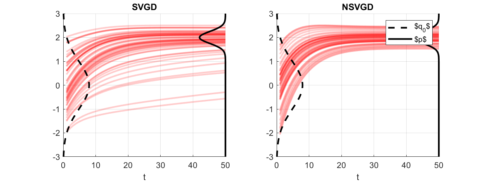
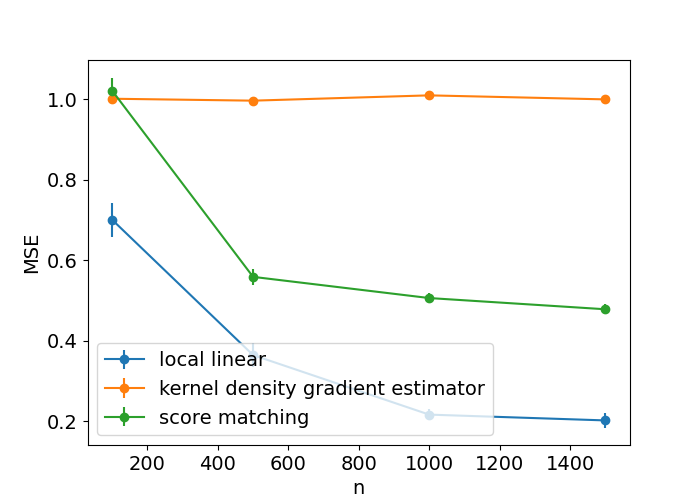

# Experiments README

## SVGD vs. NSVGD 
open MATLAB, run ```demo_SVGD_NSVGD```



----

The following experiments require a CUDA-enabled GPU.

Before running the python scripts, please 
compile CUDA code by running. 
```bash
cd external
./make.sh
```

## Gradient Estimation 1
```bash
python3 demo_locallinear_vs_logiNN.py
```


## Gradient Estimation 2
```bash
python3 demo_estimation_error_over_n.py
```


## Wasserstein Gradient Flow
```bash
python3 demo_MNIST.py
```
### Forward KL WGF
<video width="480" height="480" controls>
  <source src="figs/fKL_MNIST.mp4" type="video/mp4">
</video>

### Backward KL WGF
<video width="480" height="480" controls>
  <source src="figs/rKL_MNIST.mp4" type="video/mp4">
</video>