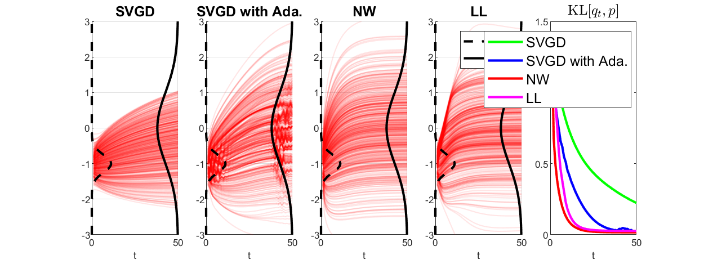

- ```demo_mirror.m``` find the mirror divergence given $\phi$.
```
phi =

  function_handle with value:

    @(r)r*log(r)


 2
r    1
-- - -
 2   2
```
- ```demo_SVGD_NW_LL.m``` comparison between SVGD, Nadaraya Watson and Local Linear.


- ```demo_caltechoffice.py``` domain transfer on the CalcTechOffice dataset.
- ```demo_impute_toy.m``` impute missing "S"-shaped data. 
- ```demo_impute_Breast.py``` impute missing Breast Cancer data with varying missing rate. 